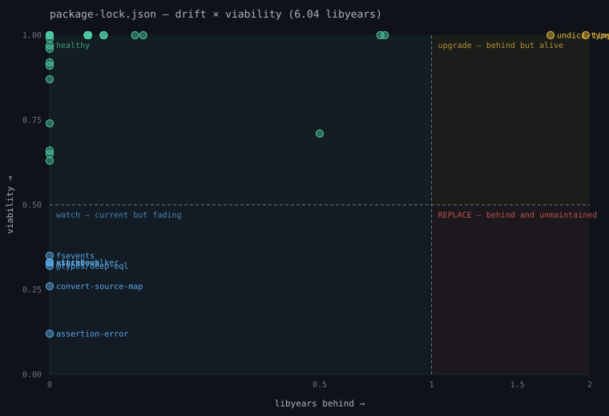

# depwatch

[](https://github.com/fabiocicerchia/depwatch/actions/workflows/code-quality.yml)
[](https://github.com/fabiocicerchia/depwatch/actions/workflows/security.yml)
[](LICENSE)
[](https://securityscorecards.dev/viewer/?uri=github.com/fabiocicerchia/depwatch)
[](.github/workflows/carbon-badge.yml)

Measures dependencies on two axes and plots them against each other:

- **Drift** — how far behind you are, in *libyears*. Objective and computable.
- **Viability** — can you even catch up? Maintainer activity, bus factor,
  release cadence, archived status, funding signals, last commit.

A dependency 0.2 libyears behind whose sole maintainer vanished is more dangerous
than one 4 libyears behind under active development. Existing tools measure one
axis or the other — **plotting both, the quadrant chart is the product** (and the
screenshot that sells it).



The libyear metric is from Cox, Bouwers, van Eekelen & Visser, "Measuring
Dependency Freshness in Software Systems" (ICSE 2015) — credited prominently.
Prior art to respect, not reinvent: libyear-bundler, libyear-npm,
jdanil/libyear, libyear-maven-plugin, `libyear` on PyPI. jdanil's split of
*drift* (version age) from *pulse* (time since the dep's latest release) is worth
stealing — pulse is the viability axis, nearly free from the same API responses.

## Install

```sh
npm install
npm run build       # -> dist/cli.js
```

## Usage

```sh
node dist/cli.js check package.json          # drift + viability table
node dist/cli.js check package.json --json    # machine-readable, for CI
node dist/cli.js chart package.json --out q.svg
```

It reads the manifest and lock files of 15+ ecosystems — npm, Python, Rust, PHP,
Ruby, Go, Java/Maven, .NET, Dart, Elixir, Terraform, Helm, GitHub Actions and
Docker — picking the right parser from the filename:

```sh
node dist/cli.js check go.mod                 # Go modules
node dist/cli.js check pyproject.toml         # Poetry / uv / PEP 621
node dist/cli.js check pom.xml                # Maven Central
node dist/cli.js check .terraform.lock.hcl    # Terraform providers
node dist/cli.js check Dockerfile             # base-image age (pulse only)
```

`depwatch --help` prints the authoritative list — it is generated from the
ecosystem registry, so it cannot drift from the code.

## In your editor

The [VS Code extension](extensions/vscode/) puts both axes on the manifest you
are editing: quadrant squiggles with a hover that explains the score, a findings
pane filtered to the current file or the whole project, the CI gates evaluated
live, and the same quadrant report in a tab.

```sh
make ext-install   # build, package a VSIX and install it into VS Code
```

## In CI

The [GitHub Action](docs/github-action.md) in this repository's root measures a
manifest and fails the build on a threshold you set:

```yaml
- uses: fabiocicerchia/depwatch@v0   # pin to a SHA in real workflows
  with:
    manifest: package.json
    max-libyears: 25                 # absolute budget
    max-libyears-increase: 0         # ...or the ratchet: do not make it worse
```

An absolute budget is awkward to adopt on a repository that is already behind —
set it high and it never fires, set it low and every pull request is red for
debt it did not create. The **ratchet** gates from the first day: it measures the
pull request's base branch too and fails only when the pull request adds drift.

It writes a quadrant summary to the job summary, optionally to a sticky pull
request comment, and exposes `libyears`, `delta` and `passed` as step outputs.
depwatch runs it on itself in [`depwatch.yml`](.github/workflows/depwatch.yml).

## Documentation

Full docs live in [`docs/`](docs/) — including [the extension's design](docs/vscode.md).
Runnable examples live in [`examples/`](examples/).

## Contributing

See [CONTRIBUTING.md](CONTRIBUTING.md). Security issues go through
[GitHub Security Advisories](https://github.com/fabiocicerchia/depwatch/security/advisories/new),
never a public issue — see [SECURITY.md](SECURITY.md).

## License

Licensed under the Apache License, Version 2.0. See [LICENSE](LICENSE).
