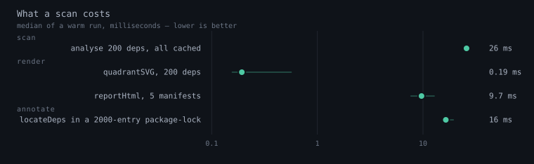

# Performance

depwatch runs inside an editor, on every save. That budget is the constraint
everything here is designed against: a scan has to be cheap enough that you
forget it is happening.

Run `make bench` to reproduce these numbers on your own machine, or
`make bench-chart` to redraw the figure. Every measurement is a warm run with
the registry answers already cached — the network is not in the picture, because
on a normal save it is not in the picture either.

## Reading it

| Measurement | When it happens |
|---|---|
| `analyse` | Once per manifest per scan. Drift, timeline signals and viability for 200 dependencies, with every registry answer in hand. |
| `quadrantSVG` | Once per manifest, whenever the report is rebuilt. |
| `reportHtml` | The whole webview page — five manifests, a thousand table rows. |
| `locateDeps` | Once per save of a manifest, to place the squiggles. Measured against a 2000-entry `package-lock.json`. |

The spread behind each mark is min to p99, so the figure says how *steady* a
number is and not only what it is. The axis is logarithmic: these span three
orders of magnitude, and a linear axis would draw the fastest of them as a
single pixel.

## What keeps it cheap

Three caches, each answering a different question:

| Cache | Question | Lifetime |
|---|---|---|
| File stamps | Did the manifest or its lock actually change? | Per session |
| Dependency signature | Are the deps and versions the same as last scan? | Per session |
| Registry (`registry/`) | What versions exist for this package? | 12 hours |
| Release dates (`dates/`) | When did these specific versions ship? | 30 days |
| Deep metadata (`deep/`) | Maintainers, funding, archived, last commit. | 72 hours |

The release-date cache matters more than its size suggests. Maven, Terraform,
Go, Docker and GitHub Actions publish version lists *without* dates and date
each version separately — Maven sends a `HEAD` per version. Thirteen requests
per dependency, so a 60-dependency `pom.xml` is around 780 requests. Caching the
version list alone left every one of those to be re-sent on every scan; a
release date cannot change, so now they are sent once.

Two more things bound the cost inside the editor:

- **The report page is throttled.** A scan publishes partial results several
  times a second. Rebuilding the page that often is wasted work, and it threw
  away your scroll position and column sort each time. It now rebuilds at most
  once a second, and not at all while the tab is hidden.
- **The in-memory cache is bounded by bytes, not entries.** A version list runs
  from a few hundred bytes to a couple of hundred kilobytes, so a 200-entry cap
  is anywhere between 40 KB and 40 MB. The byte cap is the one that holds.

## What is actually enforced

The benchmarks above are a tool, not a gate. They are deliberately not wired
into CI: a wall-clock number from a shared runner measures the runner, and a
benchmark nobody trusts is a benchmark nobody reads.

What CI enforces instead is **counting** — assertions on work done rather than
time taken, which are deterministic:

- `src/report.test.ts` → `request budget`: a version list is fetched once
  however many scans ask for it, and undated versions are dated once rather
  than once per scan.
- `extensions/vscode/src/cache.test.ts` → `memory cap`: entries are evicted on
  both the count and the byte cap, least-recently-used first.
- `extensions/vscode/src/schedule.test.ts` → `Burst`: twenty-five changes
  produce two updates.

If a change makes depwatch slower, one of those is what should notice.
